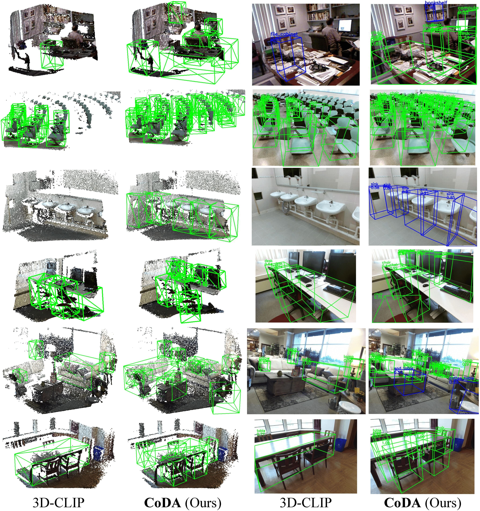

## :book: CoDA: Collaborative Novel Box Discovery and Cross-modal Alignment for Open-vocabulary 3D Object Detection (NeurIPS2023)
<p align="center">
  <small> 🔥If CoDA is helpful for your community, please help to star it ⭐ and share it. Thanks🔥 </small>
</p>

> [[Paper](https://arxiv.org/abs/2310.02960)] &emsp; [[Project Page](https://yangcaoai.github.io/publications/CoDA.html)] <br>
<!-- > [Yang Cao](https://harlanhong.github.io), Yihan Zeng, [Hang Xu](https://xuhangcn.github.io/), [Dan Xu](https://www.danxurgb.net) <br> -->
<!-- > The Hong Kong University of Science and Technology, Huawei Noah's Ark Lab -->
> [Yang Cao](https://harlanhong.github.io), Yihan Zeng, [Hang Xu](https://xuhangcn.github.io/), [Dan Xu](https://www.danxurgb.net) <br>
> The Hong Kong University of Science and Technology<br>
> Huawei Noah's Ark Lab

:triangular_flag_on_post: **Updates**  

&#9745; All the codes, data and pretrained models have beed released!

&#9745; The training and testing codes have been released.

&#9745; The pretrained models have been released.

&#9745; The OV-setting SUN-RGBD datasets have been released.  

&#9745; The OV-setting ScanNet datasets have been released.


## Framework  


## Samples  


## Installation
Our code is based on PyTorch 1.8.1, torchvision==0.9.1, CUDA 10.1 and Python 3.7. It may work with other versions.

Please also install the following Python dependencies:

```
matplotlib
opencv-python
plyfile
'trimesh>=2.35.39,<2.35.40'
'networkx>=2.2,<2.3'
scipy
```

Please install `pointnet2` layers by running

```
cd third_party/pointnet2 && python setup.py install
```

Please install a Cythonized implementation of gIOU for faster training.
```
conda install cython
cd utils && python cython_compile.py build_ext --inplace
```

## Dataset preparation

To achieve the OV setting, we re-organize the original [ScanNet](https://github.com/facebookresearch/votenet/tree/main/scannet) and [SUN RGB-D](https://github.com/facebookresearch/votenet/tree/main/sunrgbd) and adopt annotations of more categories. Please directly download the ov-setting datasets we provide here: [OV SUN RGB-D](https://hkustconnect-my.sharepoint.com/:f:/g/personal/ycaobd_connect_ust_hk/EqeHrtMq5aZBmnZUR79vub4B9HZIBxYLd5K7z6VuvemHzg?e=e7ooDv) and [OV ScanNet](https://hkustconnect-my.sharepoint.com/:f:/g/personal/ycaobd_connect_ust_hk/EsqoPe7-VFxOlY0a-v1-vPwBSiEHoGRTgK5cLIhnjyXiEQ?e=jY7nKT).

Then run for the downloaded *.tar file:
```
mv sunrgbd_trainval.tar Data/sunrgb_d/
mv sunrgbd_v1_revised_0415.tar Data/sunrgb_d/
cd Data/sunrgb_d/
tar -xvf sunrgbd_v1_revised_0415.tar
tar -xvf sunrgbd_trainval.tar
cd -
mv scannet200_data.tar.* Data/scannet/
cd Data/scannet/
cat scannet200_data.tar.* | tar -xvf
cd -
```

## Evaluation
Download the pretrained models [here](https://drive.google.com/file/d/1fTKX1ML5u8jJ249GwAYqdCZGs941907H/view?usp=drive_link).
Run:
```
bash test_release_models.sh
```

## Training
Run:
```
bash coda_sunrgbd_stage1.sh
bash coda_sunrgbd_stage2.sh
```

## :scroll: BibTeX
If CoDA is helpful, please cite:
```
@inproceedings{cao2023coda,
  title={CoDA: Collaborative Novel Box Discovery and Cross-modal Alignment for Open-vocabulary 3D Object Detection},
  author={Cao, Yang and Zeng, Yihan and Xu, Hang  and  Xu, Dan},
  booktitle={NeurIPS},
  year={2023}
}   
```

### :e-mail: Contact

If you have any question or collaboration need (research purpose or commercial purpose), please email `yangcao.cs@gmail.com`.

## :scroll: Acknowledgement
CoDA is inspired by [CLIP](https://github.com/openai/CLIP) and [3DETR](https://github.com/facebookresearch/3detr). We appreciate their great codes.
