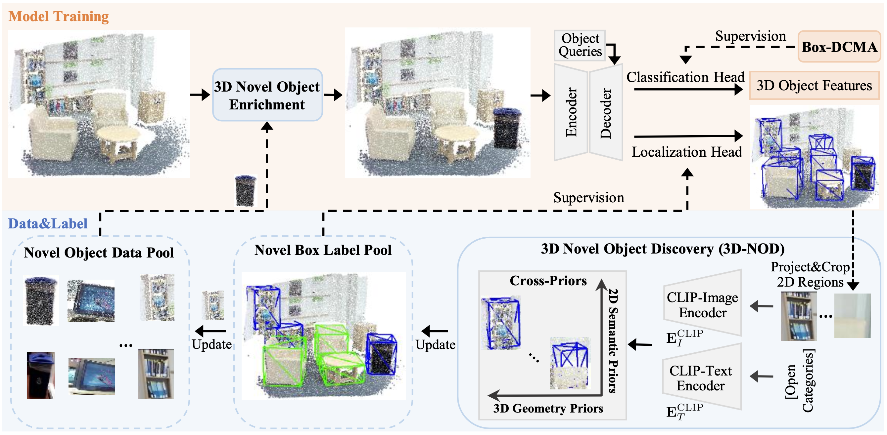

## :book: CoDAv2: Collaborative Novel Object Discovery and Box-Guided Cross-Modal Alignment for Open-Vocabulary 3D Object Detection (TPAMI 2025)
<p align="center">
  <small> 🔥Please star CoDAv2 ⭐ and share it. Thanks🔥 </small>
</p>

> [[Paper](https://arxiv.org/pdf/2406.00830v2)] &emsp; [[Project Page](https://yangcaoai.github.io/publications/CoDA.html)] <br>
<!-- > [Yang Cao](https://yangcaoai.github.io/), Yihan Zeng, [Hang Xu](https://xuhangcn.github.io/), [Dan Xu](https://www.danxurgb.net) <br> -->
<!-- > The Hong Kong University of Science and Technology, Huawei Noah's Ark Lab -->
> [Yang Cao](https://yangcaoai.github.io/), Yihan Zeng, [Hang Xu](https://xuhangcn.github.io/), [Dan Xu](https://www.danxurgb.net) <br>
> The Hong Kong University of Science and Technology<br>
> Huawei Noah's Ark Lab

:triangular_flag_on_post: **Updates**  

&#9745; Our new work **CoDAv2** is accepted by TPAMI, check out it [here](https://arxiv.org/pdf/2406.00830v2) !

&#9745; As the first work to introduce 3D Gaussian Splatting into 3D Object Detection, 3DGS-DET is released [here](https://arxiv.org/pdf/2410.01647) !

&#9745; Latest papers&codes about open-vocabulary perception are collected [here](https://github.com/yangcaoai/Awesome-Open-Vocabulary-Perception).

&#9745; All the codes, data and pretrained models have been released!

&#9745; The training and testing codes have been released.

&#9745; The pretrained models have been released.

&#9745; The OV-setting SUN-RGBD datasets have been released.  

&#9745; The OV-setting ScanNet datasets have been released.

&#9745; Paper LaTeX codes are available at https://scienhub.com/Yang/CoDA.

## Framework  


## Samples  


## Installation
Our code is based on PyTorch 1.8.1, torchvision==0.9.1, CUDA 10.1 and Python 3.7. It may work with other versions.

Please also install the following Python dependencies:

```
matplotlib
opencv-python
plyfile
'trimesh>=2.35.39,<2.35.40'
'networkx>=2.2,<2.3'
scipy
```

Please install `pointnet2` layers by running

```
cd third_party_pointnet2/pointnet2 && python setup.py install
```

Please install a Cythonized implementation of gIOU for faster training.
```
conda install cython
cd utils && python cython_compile.py build_ext --inplace
```

## Dataset Preparation
Note: If you have conducted this step for CoDAv1, you could skip this step. The datasets are the same.

To achieve the OV setting, we re-organize the original [ScanNet](https://github.com/facebookresearch/votenet/tree/main/scannet) and [SUN RGB-D](https://github.com/facebookresearch/votenet/tree/main/sunrgbd) and adopt annotations of more categories. Please directly download the ov-setting datasets we provide here: [OV SUN RGB-D](https://huggingface.co/datasets/YangCaoCS/Open-Vocabulary-SUN-RGBD) and [OV ScanNet](https://huggingface.co/datasets/YangCaoCS/Open-Vocabulary-ScanNet). 

<!-- > https://hkustconnect-my.sharepoint.com/:f:/g/personal/ycaobd_connect_ust_hk/EsqoPe7-VFxOlY0a-v1-vPwBSiEHoGRTgK5cLIhnjyXiEQ?e=jY7nKT -->

Then run for the downloaded *.tar file:
```
bash data_preparation.sh
```

## Box Guidance Preparation
```
bash box_guidance_preparation.sh
```


## Evaluation
<!-- > Download the pretrained models [here](https://drive.google.com/file/d/1fTKX1ML5u8jJ249GwAYqdCZGs941907H/view?usp=drive_link). -->
Download the pretrained models [here](https://huggingface.co/YangCaoCS/codav2_released_models).
Then run:
```
bash test_release_models.sh
```

## Training
```
bash scripts/codav2_release/prepare_codav1_stage1.sh
bash scripts/coda_sunrgbd_stage2.sh
bash scripts/coda_scannet_stage2.sh
```
## Running Samples
```
bash run_samples.sh
```

## :scroll: BibTeX
If CoDAv2 is helpful, please cite:
```
@inproceedings{cao2023coda,
  title={CoDA: Collaborative Novel Box Discovery and Cross-modal Alignment for Open-vocabulary 3D Object Detection},
  author={Cao, Yang and Zeng, Yihan and Xu, Hang and Xu, Dan},
  booktitle={NeurIPS},
  year={2023}
}

@article{cao2024collaborative,
  title={Collaborative Novel Object Discovery and Box-Guided Cross-Modal Alignment for Open-Vocabulary 3D Object Detection},
  author={Cao, Yang and Zeng, Yihan and Xu, Hang and Xu, Dan},
  journal={IEEE Transactions on Pattern Analysis and Machine Intelligence (TPAMI)},
  year={2025}
}
```

## :e-mail: Contact

If you have any question or collaboration need (research purpose or commercial purpose), please email `yangcao.cs@gmail.com`.

## :scroll: Acknowledgement
CoDAv2 is inspired by [CLIP](https://github.com/openai/CLIP) and [3DETR](https://github.com/facebookresearch/3detr). We appreciate their great codes.
